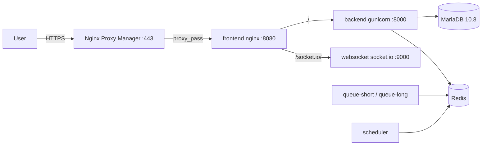

# PYDLLM Billing — Deployment Guide

This document describes the production deployment setup for the Frappe HRMS instance hosted at `ledger.pn.sorsiri.in`.

## Repository

- **GitHub:** [https://github.com/eunginx/pydllm_billing](https://github.com/eunginx/pydllm_billing)
- **Public domain:** `ledger.pn.sorsiri.in`
- **Branch:** `main`

## Architecture Overview



A **single** production image (`ghcr.io/eunginx/pydllm_billing`) is built from the upstream
[`frappe/frappe_docker`](https://github.com/frappe/frappe_docker) layered Containerfile, with
`frappe`, `erpnext`, `payments`, and `hrms` pre-installed at **build time**. No runtime
`bench init` is needed.

## Components

| Service | Purpose |
|---|---|
| `configurator` | One-shot: writes `apps.txt`, points bench at mariadb/redis, creates the site + installs erpnext/hrms on first boot |
| `backend` | Gunicorn application server (`:8000`) |
| `frontend` | Nginx reverse proxy (`:8080`) — routes HTTP to backend and `/socket.io/` to websocket |
| `websocket` | Socket.IO server (`:9000`) |
| `queue-short` / `queue-long` | Background workers |
| `scheduler` | Cron / scheduler |
| `mariadb` | Database |
| `redis` | Cache, queue, and socket.io broker |

## Files

| File | Purpose |
|---|---|
| [docker/docker-compose.portainer.yml](docker/docker-compose.portainer.yml) | Production Docker Compose stack (single image) |
| [.github/helper/apps.json](.github/helper/apps.json) | Apps pre-installed into the image at build time |
| [.github/workflows/deploy-portainer.yml](.github/workflows/deploy-portainer.yml) | Builds the image, pushes to GHCR, triggers the Portainer webhook |
| [.github/workflows/ci.yml](.github/workflows/ci.yml) | CI validation (install deps + build frontend assets) |
| [scripts/build-local.sh](scripts/build-local.sh) | Local image build helper |
| [.env.example](.env.example) | Environment variable template |

## CI/CD Flow (GitHub Actions → GHCR → Portainer)

1. **Push to `main`** triggers `deploy-portainer.yml`.
2. The workflow checks out `frappe/frappe_docker` and builds the layered image with
   `FRAPPE_BRANCH=version-16` and the `apps.json` secret.
3. The image is pushed to `ghcr.io/eunginx/pydllm_billing:latest`.
4. The Portainer webhook is fired, which redeploys the stack (Portainer GitOps auto-update
   also polls the repo every 1 minute).

## Environment Variables (Portainer)

| Variable | Required | Example | Description |
|---|---|---|---|
| `FRAPPE_SITE_NAME_HEADER` | Yes | `ledger.pn.sorsiri.in` | Site domain |
| `MYSQL_ROOT_PASSWORD` | Yes | `change-me` | MariaDB root password |
| `ADMIN_PASSWORD` | Yes | `change-me` | Frappe Administrator password |
| `NGINX_HOST_PORT` | No | `8484` | Host port for the frontend nginx |
| `NPM_NETWORK` | No | `monitor_monitoring` | External NPM network name |

## Reverse Proxy (Nginx Proxy Manager)

The `frontend` service joins the external NPM network (`monitor_monitoring`), so NPM can
reach it by container name. Create a proxy host for `ledger.pn.sorsiri.in`:

| Field | Value |
|---|---|
| **Forward Hostname / IP** | `frontend` |
| **Forward Port** | `8080` |
| **Websockets Support** | ✅ ON (required for socket.io) |

Then add SSL (Let's Encrypt) and enable **Force SSL** if HTTPS is desired.

> **Note:** container-name routing (`frontend:8080`) only works when NPM and the Frappe
> stack share the same Docker host. If they are on separate hosts, use the host IP +
> published port (`8484`) instead.

## Local Build

```bash
./scripts/build-local.sh            # build for the host arch (arm64 on Mac)
./scripts/build-local.sh --push     # also push to GHCR (needs docker login)
```

> The local build targets the **host architecture**. The CI workflow builds **amd64** on
> `ubuntu-latest` for EC2, so you do not need to push a local arm64 image for EC2.

## Default Login

- Username: `Administrator`
- Password: set via `ADMIN_PASSWORD`

## Troubleshooting

### Stack fails with "network monitor_monitoring not found"

The external NPM network must exist on the Docker host before the stack deploys. It is
created by the NPM stack. If the network has a different name, set `NPM_NETWORK`.

### MariaDB healthcheck fails with "Access denied"

Ensure `MYSQL_PWD` is set to the same value as `MYSQL_ROOT_PASSWORD` (the healthcheck
script reads `MYSQL_PWD` for authentication).

### Site not created

Check the `configurator` container logs. It should exit with code `0` after creating the
site and installing `erpnext` + `hrms`. A non-zero exit means the site creation failed.
