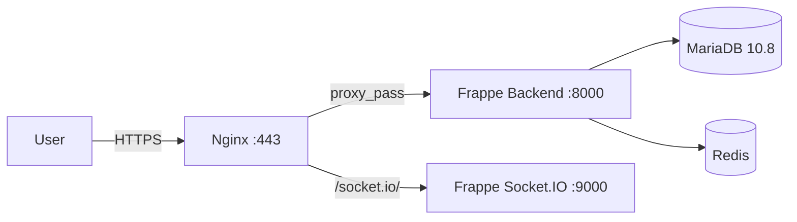

# PYDLLM Billing — Deployment Guide

This document describes the production deployment setup for the Frappe HRMS instance hosted at `ledger.pn.sorsiri.in`.

## Repository

- **GitHub:** [https://github.com/eunginx/pydllm_billing](https://github.com/eunginx/pydllm_billing)
- **Public domain:** `ledger.pn.sorsiri.in`
- **Branch:** `main`

## Architecture Overview



Components:

| Component | Service in Compose | Purpose |
|---|---|---|
| Nginx | `nginx` | TLS termination and reverse proxy |
| Frappe Bench | `backend` | Frappe/ERPNext/HRMS application server |
| MariaDB | `mariadb` | Database |
| Redis | `redis` | Cache, queue, and socket.io broker |

## Files Added for Production

| File | Purpose |
|---|---|
| [docker/docker-compose.prod.yml](docker/docker-compose.prod.yml) | Production Docker Compose stack |
| [docker/nginx/nginx.conf](docker/nginx/nginx.conf) | Nginx reverse proxy configuration |
| [.env.example](.env.example) | Environment variable template |
| [teamcity/deploy.sh](teamcity/deploy.sh) | TeamCity deployment script |
| [.github/workflows/ci.yml](.github/workflows/ci.yml) | GitHub Actions CI workflow |
| [.github/workflows/deploy.yml](.github/workflows/deploy.yml) | GitHub Actions deploy workflow |

## Pre-Deployment Requirements

Before the first deployment, ensure the production host has:

1. **Docker Engine** and **Docker Compose** plugin installed.
2. **TeamCity Agent** running on the same host (local deploy mode).
3. **Node.js 20 LTS** and **npm** installed on the TeamCity agent.
   ```bash
   curl -fsSL https://deb.nodesource.com/setup_20.x | bash -
   apt-get install -y nodejs
   ```
4. **TLS certificates** placed at:
   - `docker/nginx/ssl/fullchain.pem`
   - `docker/nginx/ssl/privkey.pem`
5. **DNS record** for `ledger.pn.sorsiri.in` pointing to the host.

## TeamCity Configuration

### Build Step

Create a single **Command Line** build step with:

```bash
./teamcity/deploy.sh
```

### Environment Variables

Configure these as **Environment Variables** in the TeamCity build configuration:

| Variable | Required | Example | Description |
|---|---|---|---|
| `DEPLOY_PATH` | Yes | `/opt/pydllm_billing` | Runtime path for the deployed application |
| `DEPLOY_HOST` | No | `user@ledger.pn.sorsiri.in` | Optional SSH target if agent is remote |
| `MYSQL_ROOT_PASSWORD` | Yes | `change-me` | MariaDB root password |
| `ADMIN_PASSWORD` | Yes | `change-me` | Frappe Administrator password |

If `DEPLOY_HOST` is omitted, the script runs in **local deploy mode** and deploys on the agent host itself.

### SSH Keys (only for remote deploy mode)

If `DEPLOY_HOST` is set, ensure the TeamCity agent can SSH to the target host without a password. Add the agent's public key to `~/.ssh/authorized_keys` on the target.

## Deployment Flow

The `teamcity/deploy.sh` script performs the following steps:

1. **Build frontend assets**
   - Runs in the TeamCity checkout directory (`/opt/buildagent/work/...`).
   - Uses local `npm` to run:
     ```bash
     npm install
     npm run build
     ```
2. **Sync to runtime path**
   - Uses `rsync -a --delete` to copy files from the checkout to `DEPLOY_PATH`.
   - Excludes `.git` and `node_modules` to keep the runtime path clean.
3. **Ensure environment file**
   - If `.env` does not exist, copies `.env.example` to `.env`.
4. **Start production stack**
   - Pulls images.
   - Stops any running stack.
   - Starts the stack with `--build`.
   ```bash
   docker compose -f docker/docker-compose.prod.yml up -d --build
   ```
5. **Cleanup**
   - Prunes dangling Docker images.

## Reverse Proxy Settings

Nginx is included in the production compose and listens on:

| Port | Protocol | Purpose |
|---|---|---|
| 80 | HTTP | Redirects to HTTPS |
| 443 | HTTPS | Serves the application |

Upstream targets:

| Path | Upstream |
|---|---|
| `/` | `backend:8000` |
| `/assets/` | `backend:8000` |
| `/socket.io/` | `backend:9000` |

Critical header: `proxy_set_header Host $host;` — this ensures Frappe serves the correct site (`ledger.pn.sorsiri.in`).

## First-Time Setup on Production Host

```bash
# 1. Clone the repo
sudo mkdir -p /opt/pydllm_billing
sudo chown $USER:$USER /opt/pydllm_billing
git clone --branch main --single-branch https://github.com/eunginx/pydllm_billing.git /opt/pydllm_billing

# 2. Configure environment
cd /opt/pydllm_billing
cp .env.example .env
# Edit .env and set strong passwords

# 3. Add TLS certificates
sudo mkdir -p docker/nginx/ssl
sudo cp /path/to/fullchain.pem docker/nginx/ssl/fullchain.pem
sudo cp /path/to/privkey.pem docker/nginx/ssl/privkey.pem

# 4. Start the stack
sudo docker compose -f docker/docker-compose.prod.yml up -d --build
```

After the first deploy, TeamCity will manage subsequent updates automatically.

## Frappe Site Name

The site is configured as `ledger.pn.sorsiri.in` in:

- [docker/init.sh](docker/init.sh#L30) — for the initial site creation.
- [docker/docker-compose.prod.yml](docker/docker-compose.prod.yml) — via `FRAPPE_SITE_NAME_HEADER`.
- [docker/nginx/nginx.conf](docker/nginx/nginx.conf) — via `server_name`.

## Development vs Production

| Environment | Compose File | Access URL |
|---|---|---|
| Development | [docker/docker-compose.yml](docker/docker-compose.yml) | `http://ledger.pn.sorsiri.in:8000` |
| Production | [docker/docker-compose.prod.yml](docker/docker-compose.prod.yml) | `https://ledger.pn.sorsiri.in` |

Default login credentials:

- Username: `Administrator`
- Password: `admin` (set via `ADMIN_PASSWORD`)

## Troubleshooting

### Build fails with "npm is not installed"

Install Node.js 20 LTS on the TeamCity agent:

```bash
curl -fsSL https://deb.nodesource.com/setup_20.x | bash -
apt-get install -y nodejs
```

### Frappe serves the wrong site

Ensure `FRAPPE_SITE_NAME_HEADER=ledger.pn.sorsiri.in` is set in `.env` and the nginx `Host` header is forwarded.

### TLS certificate errors

Verify the certificate files exist and are readable inside the nginx container:

```bash
sudo docker compose -f docker/docker-compose.prod.yml exec nginx ls -la /etc/nginx/ssl
```

### Container cannot access database

Ensure the `backend` container can resolve `mariadb` and the `MYSQL_ROOT_PASSWORD` in `.env` matches the database state.

## Change Log

| Date | Commit | Change |
|---|---|---|
| 2026-08-13 | `2eb220d` | Initial commit with site `ledger.pn.sorsiri.in` |
| 2026-08-13 | `ed73861` | Added production compose, nginx, workflows, README |
| 2026-08-13 | `90ae71d` | Documented TeamCity environment variables |
| 2026-08-13 | `1547465` | Support local TeamCity agent deployment |
| 2026-08-13 | `992064d` | Added Docker Node fallback for frontend build |
| 2026-08-13 | `73cd2e1` | Fixed `workspaces` typo in `package.json` |
| 2026-08-13 | `9feffbe` | Made root `package.json` scripts npm-compatible |
| 2026-08-13 | `d689a1d` | Build in checkout dir, rsync to deploy path |
| 2026-08-14 | `8540f6d` | Require local npm/Node on agent |
